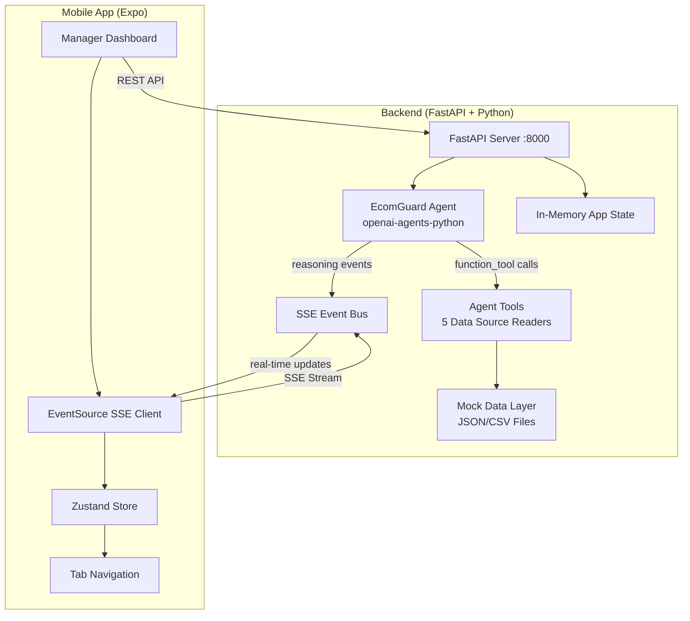

# EcomGuard — Implementation Plan

**Autonomous Product Crisis Intelligence Agent — Manager Dashboard**

---

## Goal

Build a complete end-to-end hackathon prototype consisting of:
1. **Python Backend** — FastAPI server with SSE streaming, hosting the autonomous EcomGuard agent built on `openai-agents-python` SDK using Groq (GPT-OSS-120B)
2. **Expo Mobile App** — React Native dashboard for the manager to observe agent reasoning, approve/reject actions, and view outcome reports
3. **Mock Data Layer** — 5 data sources with planted contradictions and noise for the demo scenario

---

## Resolved Configuration

| Item | Decision |
|------|----------|
| **Groq API Key** | ✅ Confirmed — provided by user |
| **Model** | `openai/gpt-oss-120b` via Groq API |
| **Fallback Model** | None — Groq only |
| **Backend Port** | `8000` |
| **Mobile → Backend** | `EXPO_PUBLIC_API_URL` env var (dev machine local IP) |
| **Charts** | Victory Native (fallback to simpler approach if Expo Go incompatible) |
| **Demo Features** | Auto-stream + reset only — no additional demo-mode features |

---

## Architecture Overview



---

## Proposed Changes

### Component 1: Project Root & Configuration

#### [NEW] [pyproject.toml](file:///c:/Users/kk/Desktop/EcomGuard/pyproject.toml)
Python project configuration with dependencies:
- `fastapi[standard]` (includes uvicorn)
- `openai-agents` (OpenAI Agents SDK)
- `groq` (Groq client for custom model provider)
- `pydantic>=2.0`
- `python-dotenv`

#### [NEW] [.env.example](file:///c:/Users/kk/Desktop/EcomGuard/.env.example)
Template for environment variables:
- `GROQ_API_KEY=gsk_...` (Groq API key)
- `MODEL_NAME=openai/gpt-oss-120b`
- `PORT=8000`

#### [NEW] [README.md](file:///c:/Users/kk/Desktop/EcomGuard/README.md)
Full documentation per submission requirements: architecture, data schemas, tools/APIs, Antigravity role, setup steps, assumptions, privacy note, cost/latency, scalability, baseline comparison, limitations.

---

### Component 2: Mock Data Sources

All 5 data sources as static files the agent reads via tools.

#### [NEW] [backend/data/ds01_reviews.json](file:///c:/Users/kk/Desktop/EcomGuard/backend/data/ds01_reviews.json)
24 customer reviews over 7 days for CBL-047 USB-C Cable:
- **21 genuine reviews** (mix of positive early reviews, then escalating complaints about overheating/melting)
- **3 noise reviews**: 1 spam (generic "great product"), 1 duplicate (same text different username), 1 wrong-batch (customer purchased batch B2024-09, not B2024-11)
- Each review has: `id`, `product_sku`, `batch`, `rating`, `text`, `reviewer`, `date`, `purchase_date`

#### [NEW] [backend/data/ds02_sales_returns.csv](file:///c:/Users/kk/Desktop/EcomGuard/backend/data/ds02_sales_returns.csv)
30 days of daily sales data for all 6 SKUs:
- Columns: `date`, `sku`, `product_name`, `units_sold`, `units_returned`, `return_reason`, `revenue_pkr`
- **Planted signal**: CBL-047 return rate jumps from ~2% to ~18% starting day 22 (3 days after batch B2024-11 arrived)
- **Planted contradiction**: Implies ~340 units of CBL-047 remaining (based on sold - returned + restocked)

#### [NEW] [backend/data/ds03_supplier_report.json](file:///c:/Users/kk/Desktop/EcomGuard/backend/data/ds03_supplier_report.json)
Supplier quality report for CBL-047 batch B2024-11:
- Supplier: ShenZhen CableWorks Ltd
- Batch size: 500 units, failure rate reported: 0.4% (2 units)
- Certifications: CE, FCC (but UL certification expired 3 months ago)
- External flag: "Under review by Consumer Safety Board of Guangdong Province"
- **Planted contradiction**: Says 480 units shipped (vs. sales data saying different number, vs. warehouse saying different number)

#### [NEW] [backend/data/ds04_warehouse_inventory.json](file:///c:/Users/kk/Desktop/EcomGuard/backend/data/ds04_warehouse_inventory.json)
Warehouse stock table for all 6 SKUs:
- Fields: `sku`, `product_name`, `quantity_in_stock`, `last_updated`, `location`, `batch`
- **Planted contradiction**: Shows CBL-047 stock as 412 units (stale data, last updated 5 days ago — doesn't account for recent sales/returns)

#### [NEW] [backend/data/ds05_market_news.json](file:///c:/Users/kk/Desktop/EcomGuard/backend/data/ds05_market_news.json)
Market intelligence article:
- Headline: "ShenZhen CableWorks Under Investigation for USB-C Cable Defects in Southeast Asian Markets"
- Body: Industry report about the same supplier having cable overheating issues in Malaysia/Indonesia
- Timestamp: 2 days ago
- Source credibility: Medium (industry blog, not mainstream news)

---

### Component 3: Backend Core

#### [NEW] [backend/__init__.py](file:///c:/Users/kk/Desktop/EcomGuard/backend/__init__.py)
Empty init file.

#### [NEW] [backend/main.py](file:///c:/Users/kk/Desktop/EcomGuard/backend/main.py)
FastAPI application entry point:
- CORS middleware for Expo dev client
- Router registration (reviews, agent, actions, state)
- Startup event to initialize in-memory state
- SSE event bus endpoint (`GET /events`)

#### [NEW] [backend/config.py](file:///c:/Users/kk/Desktop/EcomGuard/backend/config.py)
Settings via pydantic-settings:
- Groq API key, model name
- Business constraints (budget: 50,000 PKR, max daily notifications: 500, supplier contact frequency: 1 per 48hrs)

#### [NEW] [backend/state.py](file:///c:/Users/kk/Desktop/EcomGuard/backend/state.py)
In-memory application state (no database needed):
```python
@dataclass
class AppState:
    agent_status: str  # "idle" | "monitoring" | "investigating" | "awaiting_approval" | "executing" | "resolved"
    reviews: list[dict]  # Currently ingested reviews
    reasoning_log: list[dict]  # Agent's reasoning entries
    proposed_actions: list[dict]  # Actions pending approval
    executed_actions: list[dict]  # Completed action results
    contradictions: list[dict]  # Discovered contradictions
    noise_reviews: list[dict]  # Reviews flagged as noise
    outcome_report: dict | None  # Final before/after report
    crisis_detected: bool
    investigation_started: bool
```

#### [NEW] [backend/event_bus.py](file:///c:/Users/kk/Desktop/EcomGuard/backend/event_bus.py)
Simple async event bus for SSE:
- `EventBus` class with `publish(event_type, data)` and `subscribe()` methods
- Uses `asyncio.Queue` per subscriber
- Event types: `agent_status`, `reasoning`, `review_classified`, `contradiction_found`, `actions_proposed`, `action_executing`, `action_complete`, `action_failed`, `outcome_report`, `reset`

---

### Component 4: Agent System (openai-agents-python)

#### [NEW] [backend/agent/__init__.py](file:///c:/Users/kk/Desktop/EcomGuard/backend/agent/__init__.py)

#### [NEW] [backend/agent/model_provider.py](file:///c:/Users/kk/Desktop/EcomGuard/backend/agent/model_provider.py)
Groq model provider using validated factory pattern ([reference](https://github.com/DanielHashmi/Q4_learning/blob/main/spec-driven-development/tutorials/Groq-OpenAI-Agents-Guide.md)):
```python
import os
from openai import AsyncOpenAI
from agents import OpenAIChatCompletionsModel
from dotenv import load_dotenv

load_dotenv()

GROQ_BASE_URL = "https://api.groq.com/openai/v1"

def create_groq_model(model_name: str = "openai/gpt-oss-120b"):
    api_key = os.getenv("GROQ_API_KEY")
    if not api_key:
        raise ValueError("GROQ_API_KEY environment variable is required")
    client = AsyncOpenAI(api_key=api_key, base_url=GROQ_BASE_URL)
    return OpenAIChatCompletionsModel(model=model_name, openai_client=client)
```

#### [NEW] [backend/agent/tools.py](file:///c:/Users/kk/Desktop/EcomGuard/backend/agent/tools.py)
Agent function tools (one per data source + utility tools):

| Tool | Description |
|------|-------------|
| `read_customer_reviews` | Read all currently ingested reviews from DS-01 |
| `read_sales_returns_data` | Read the 30-day sales & returns CSV from DS-02 |
| `read_supplier_report` | Read the supplier quality report from DS-03 |
| `read_warehouse_inventory` | Read current warehouse stock from DS-04 |
| `read_market_news` | Read market intelligence articles from DS-05 |
| `classify_review` | Classify a review as genuine/spam/duplicate/wrong-batch |
| `log_reasoning` | Push a reasoning entry to the manager dashboard |
| `report_contradiction` | Report a data contradiction with resolution |
| `propose_actions` | Propose a set of actions to the manager |

Each tool is decorated with `@function_tool` and pushes events to the event bus.

#### [NEW] [backend/agent/prompts.py](file:///c:/Users/kk/Desktop/EcomGuard/backend/agent/prompts.py)
System prompts for the agent:
- Business context (TechMart PK, product catalog, 6 SKUs)
- Agent role and autonomy instructions
- Constraint awareness (budget, notification limits, supplier contact rules)
- Output formatting guidelines (plain English, no raw JSON for the manager)
- Instructions to identify noise, detect contradictions, analyze temporal patterns
- Explicit instruction to NOT follow a pre-scripted investigation path

#### [NEW] [backend/agent/ecomguard_agent.py](file:///c:/Users/kk/Desktop/EcomGuard/backend/agent/ecomguard_agent.py)
Main agent definition:
```python
from agents import Agent

ecomguard = Agent(
    name="EcomGuard",
    instructions=SYSTEM_PROMPT,
    model=groq_model,
    tools=[
        read_customer_reviews,
        read_sales_returns_data,
        read_supplier_report,
        read_warehouse_inventory,
        read_market_news,
        classify_review,
        log_reasoning,
        report_contradiction,
        propose_actions,
    ],
)
```
- Uses `Runner.run_streamed()` for real-time event streaming
- Context injection via `RunContextWrapper` for shared state access

#### [NEW] [backend/agent/actions.py](file:///c:/Users/kk/Desktop/EcomGuard/backend/agent/actions.py)
Action execution engine:
- Action types: `pause_listing`, `flag_inventory`, `notify_customers_batch`, `contact_supplier`, `generate_incident_report`, `update_monitoring`
- Sequential execution with state transitions: `pending → executing → complete/failed`
- Retry logic (1 retry before escalation)
- One action (`contact_supplier`) is deliberately configured to fail on first attempt to demonstrate FR-029/FR-030/FR-031
- Fallback: generates manual draft email when supplier contact fails

---

### Component 5: API Routes

#### [NEW] [backend/routes/__init__.py](file:///c:/Users/kk/Desktop/EcomGuard/backend/routes/__init__.py)

#### [NEW] [backend/routes/events.py](file:///c:/Users/kk/Desktop/EcomGuard/backend/routes/events.py)
SSE streaming endpoint:
```python
@router.get("/events", response_class=EventSourceResponse)
async def sse_stream():
    # Subscribe to event bus, yield ServerSentEvent for each event
```

#### [NEW] [backend/routes/reviews.py](file:///c:/Users/kk/Desktop/EcomGuard/backend/routes/reviews.py)
Review management:
- `POST /api/reviews` — Add a single review (manager manual input)
- `POST /api/reviews/auto-stream` — Start auto-streaming pre-built reviews on timer
- `POST /api/reviews/stop-stream` — Stop auto-streaming
- `GET /api/reviews` — Get all current reviews with classification labels

#### [NEW] [backend/routes/agent.py](file:///c:/Users/kk/Desktop/EcomGuard/backend/routes/agent.py)
Agent control:
- `GET /api/agent/status` — Current agent status
- `POST /api/agent/investigate` — Trigger investigation (normally autonomous, but available for demo)
- `GET /api/agent/reasoning` — Get full reasoning log
- `GET /api/agent/contradictions` — Get discovered contradictions

#### [NEW] [backend/routes/actions.py](file:///c:/Users/kk/Desktop/EcomGuard/backend/routes/actions.py)
Action management:
- `GET /api/actions/proposed` — Get proposed actions
- `POST /api/actions/{id}/approve` — Approve a single action
- `POST /api/actions/{id}/reject` — Reject a single action
- `POST /api/actions/approve-all` — Approve all pending actions
- `POST /api/actions/execute` — Execute approved actions
- `GET /api/actions/results` — Get execution results

#### [NEW] [backend/routes/state.py](file:///c:/Users/kk/Desktop/EcomGuard/backend/routes/state.py)
State and reset:
- `GET /api/state` — Full dashboard state snapshot
- `POST /api/reset` — Reset entire system to initial state (FR-036, US-12)
- `GET /api/outcome` — Get outcome report with before/after metrics

---

### Component 6: Expo Mobile App

#### [NEW] [mobile/](file:///c:/Users/kk/Desktop/EcomGuard/mobile/)
Expo project created via `npx create-expo-app`:
```
mobile/
├── app/                    # Expo Router file-based routing
│   ├── _layout.tsx         # Root layout with tab navigation
│   ├── (tabs)/
│   │   ├── _layout.tsx     # Tab bar configuration
│   │   ├── index.tsx       # Dashboard (home) — agent status + health overview
│   │   ├── feed.tsx        # Live Signal Feed — add reviews, see classifications
│   │   ├── reasoning.tsx   # Agent Reasoning — live scrollable reasoning log
│   │   ├── actions.tsx     # Actions & Approval — approve/reject proposed actions
│   │   └── report.tsx      # Outcome Report — before/after metrics
│   └── settings.tsx        # Reset + demo controls
├── components/
│   ├── AgentStatusBadge.tsx     # Pulsing status indicator
│   ├── ReasoningEntry.tsx       # Single reasoning log entry
│   ├── ReviewCard.tsx           # Review with noise/genuine label
│   ├── ActionCard.tsx           # Action with approve/reject + state transitions
│   ├── ContradictionPanel.tsx   # Prominent contradiction display
│   ├── MetricCard.tsx           # Before/after metric comparison
│   ├── TimeSeriesChart.tsx      # Complaint velocity / return rate chart
│   ├── HealthSourceCard.tsx     # Individual data source health status
│   └── IncidentReport.tsx       # Generated incident report viewer
├── store/
│   └── useEcomGuardStore.ts     # Zustand store — all app state
├── hooks/
│   ├── useSSE.ts                # EventSource hook for SSE connection
│   └── useApi.ts                # REST API helper hooks
├── constants/
│   └── theme.ts                 # Color palette, typography, spacing
├── types/
│   └── index.ts                 # TypeScript type definitions
└── app.json                     # Expo configuration
```

---

### Component 7: Mobile — Tab Screens (Detail)

#### [NEW] Dashboard Tab (`index.tsx`)
- Agent status badge (monitoring → investigating → awaiting_approval → executing → resolved)
- 5 data source health cards with last-updated timestamps
- Crisis severity indicator (when detected)
- Quick-action buttons: Start Auto-Stream, Reset

#### [NEW] Live Feed Tab (`feed.tsx`)
- Manual review input form (text + rating)
- Scrollable feed of all reviews
- Each review card shows:
  - Review text and rating stars
  - Classification badge: ✅ Genuine / 🚫 Spam / 🔄 Duplicate / ⚠️ Wrong Batch
  - Agent's classification reason
- Auto-stream toggle

#### [NEW] Agent Reasoning Tab (`reasoning.tsx`)
- Live scrollable log of agent reasoning
- Each entry timestamped, categorized (observation/question/discovery/decision)
- Auto-scrolls to latest entry
- Contradiction panel (prominent, not buried — FR-017)
- Temporal analysis chart (complaint velocity over time — FR-013)

#### [NEW] Actions Tab (`actions.tsx`)
- Proposed action cards with:
  - Action description
  - Estimated cost/impact in PKR
  - Risk level badge
  - Constraint notes
  - Revenue discount explanation (FR-019)
- Approve / Reject buttons per action
- "Approve All" button
- Execution state cards: pending → executing → complete / failed → retry → escalated
- Recovery action output (manual draft when action fails)

#### [NEW] Outcome Report Tab (`report.tsx`)
- Before/after metrics grid (≥5 metrics — FR-032):
  - Product listing status
  - Units at risk
  - Supplier relationship status
  - Customer exposure
  - Brand risk level
- Baseline comparison panel (EcomGuard vs. simple threshold rule — FR-033)
- Rollback condition definition (FR-034)
- Generated incident report text (FR-035)

---

### Component 8: Mobile — Zustand Store

#### [NEW] [mobile/store/useEcomGuardStore.ts](file:///c:/Users/kk/Desktop/EcomGuard/mobile/store/useEcomGuardStore.ts)

State shape:
```typescript
interface EcomGuardState {
  // Connection
  isConnected: boolean;
  
  // Agent
  agentStatus: AgentStatus;
  
  // Reviews
  reviews: Review[];
  noiseReviews: Review[];
  isAutoStreaming: boolean;
  
  // Reasoning
  reasoningLog: ReasoningEntry[];
  
  // Contradictions
  contradictions: Contradiction[];
  
  // Actions
  proposedActions: Action[];
  executedActions: ActionResult[];
  
  // Outcome
  outcomeReport: OutcomeReport | null;
  
  // Data sources
  dataSources: DataSourceHealth[];
  
  // Actions (methods)
  addReview: (review: Review) => void;
  setAgentStatus: (status: AgentStatus) => void;
  appendReasoning: (entry: ReasoningEntry) => void;
  // ... etc
  reset: () => void;
}
```

---

## Verification Plan

### Automated Tests

1. **Backend health**: `curl http://localhost:8000/api/state` — returns initial state
2. **SSE connection**: Open EventSource at `http://localhost:8000/events` — verify heartbeat
3. **Review ingestion**: `POST /api/reviews` with sample review → appears in state + SSE event
4. **Agent investigation**: Add 5+ bad reviews → agent auto-investigates → reasoning log populates
5. **Contradiction detection**: Agent reasoning log mentions stock discrepancy across DS-02/DS-03/DS-04
6. **Noise filtering**: Agent classifies spam/duplicate/wrong-batch reviews correctly
7. **Action approval**: `POST /api/actions/{id}/approve` → action state changes
8. **Action failure**: Supplier contact action fails → retry → escalation with manual draft
9. **Reset**: `POST /api/reset` → all state returns to initial
10. **Full demo run**: Complete scenario in <5 minutes

### Manual Verification

1. **Expo Go**: Scan QR code on physical device → all tabs load and function
2. **Real-time updates**: Add review on phone → see agent react within 2 seconds
3. **Visual quality**: UI matches premium design with animations, proper typography
4. **Judge readability**: Reasoning tab readable by non-technical person without explanation

### Submission Checklist Verification

- [ ] Working mobile app prototype (Expo Go)
- [ ] 3–5 min demo video showing agentic workflow end-to-end
- [ ] 2–3 min Antigravity usage video
- [ ] Antigravity traces/logs preserved
- [ ] README with full documentation
- [ ] Baseline comparison (agent vs. simple threshold)
- [ ] Robustness evidence (action failure + recovery)
- [ ] Cost & scalability note

---

## Implementation Order

| Phase | What | Est. Effort |
|-------|------|-------------|
| 1 | Mock data files (all 5 sources) | ~30 min |
| 2 | Backend core (main, state, event bus, config) | ~45 min |
| 3 | Agent system (model provider, tools, prompts, agent) | ~60 min |
| 4 | API routes (reviews, agent, actions, state, SSE) | ~45 min |
| 5 | Expo project setup + navigation | ~30 min |
| 6 | Zustand store + SSE hook + API hooks | ~30 min |
| 7 | Mobile screens (5 tabs + components) | ~90 min |
| 8 | Action execution engine with failure/retry | ~30 min |
| 9 | Outcome report generation | ~20 min |
| 10 | Polish, testing, README | ~30 min |
